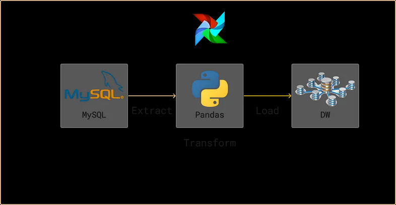

# Data Warehouse Pipeline with Airflow

This project is a sample implementation of a data warehouse pipeline using Apache Airflow. It demonstrates the steps required to extract data from a source database, transform it, and load it into a star schema in a data warehouse.

### DAGs

The `dags` folder contains the DAGs for each dimension and the fact table. Each DAG is responsible for running the necessary tasks to extract, transform, and load the data for that particular table.

### Data

The `data` folder contains sample CSV files for the source data used in this project.

### Scripts

The `scripts` folder contains SQL scripts used to create the source tables and the star schema in the data warehouse.

## Prerequisites

* Apache Airflow installed and configured
* Access to a data warehouse

## How to Use

1. Clone this repository to your local machine.
2. Create a virtual environment and activate it.
3. Install the required packages using `pip install -r requirements.txt`.
4. Create the necessary tables in your source database.
5. Update the connection IDs in the DAGs to match your Airflow connections.
6. Start the Airflow scheduler and webserver.
7. Trigger the DAGs to start the data pipeline.

## Credits

This project was created by SAID AIT OUAKOUR. Feel free to use and modify it as needed.
